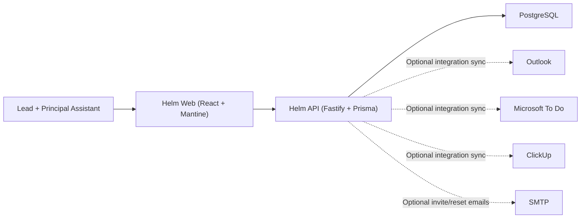
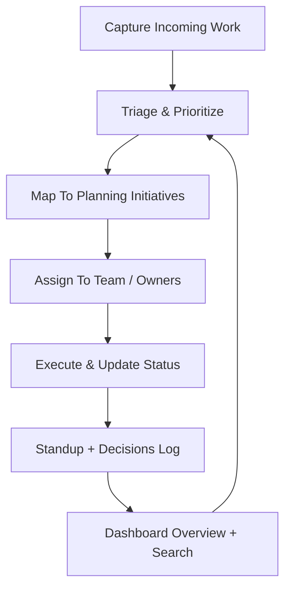
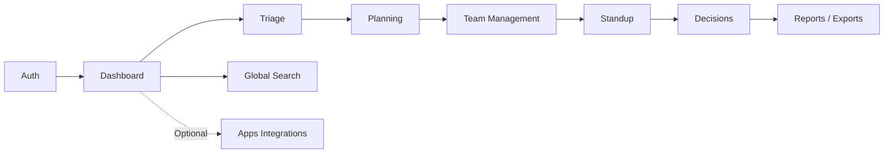

# Helm System Preview

> Developer-facing product overview for presentations, onboarding, and architecture alignment.

## Executive Snapshot

Helm is an internal operations cockpit for a two-person leadership cell (lead + principal assistant) supporting mobile banking delivery teams.

It centralizes:

- Triage and priority control
- Planning and milestone tracking
- Developer roster and team assignments
- Standups and decision history
- Optional connectors (Outlook, Microsoft To Do, ClickUp)

Core behavior is local-first and works without Microsoft or external sync.

---

## System Architecture

## Daily Operations Loop

## Capability Matrix

| Capability | What Helm Enables | Product Surface / API |
|---|---|---|
| Authentication | Local JWT auth, first-login password setup, TOTP MFA | `Login`, `First-time setup`, `/api/auth/*`, `/api/me*` |
| Triage Operations | Create, assign, reprioritize, attach files, track activity | `Dashboard`, `Triage detail`, `/api/triage-items*`, `/api/triage-attachments/*` |
| Planning | Link execution work to initiatives and milestones | `Planning`, `/api/planning*`, `/api/release-milestones*` |
| Team Operations | Manage developer directory and team memberships | `Developers`, `Team management`, `/api/developers*`, `/api/team-memberships*` |
| Coordination Rhythm | Run standups, keep decision memory, monitor health | `Standup`, `Decisions`, `/api/standup*`, `/api/decisions*`, `/api/dashboard-overview` |
| Expenses and Exports | Capture expenses, attach receipts, export CSV reports | `Expenses`, `/api/expenses*`, `/api/exports/expenses.csv`, `/api/exports/triage.csv` |
| Discovery | Fast lookup across operational data | Global search, `/api/search` |
| Optional Integrations | Pull actionable context from external apps when connected | `Apps`, `/api/integrations/*`, `/api/outlook/*`, `/api/todo/*`, `/api/clickup/*` |

## Capability Relationship View

---

## Business Impact For Our Team

1. Faster decision cycles: triage and planning stay connected.
2. Better leadership handoffs: lead and assistant share one live context.
3. Lower coordination noise: status and decisions are captured where work happens.
4. Reliable onboarding and recovery: SMTP-based invites/resets feed into secure first-login flow.
5. Optional integrations without lock-in: external apps add value but never block core work.

## 10-Minute Demo Script

1. Open `Dashboard` and explain current workload posture.
2. Drill into one `Triage` item and show ownership + activity + attachments.
3. Jump to `Planning` to show initiative alignment.
4. Open `Developers` and `Team Management` to explain assignment logic.
5. Show `Standup` and `Decisions` as execution memory.
6. End at `Apps` and emphasize optional sync model.

---

## Helm Design Language (for Presentation Consistency)

- **Visual tone:** warm canvas, sharp card surfaces, low-noise depth.
- **Typography:** `Fraunces` for display hierarchy, `Source Sans 3` for operational readability.
- **Interaction feel:** calm motion, clear state hierarchy, practical density.

| Theme | Presentation Mood | Accent |
|---|---|---|
| Ember | High-contrast, operational urgency | `#dc2626` |
| Harbor | Balanced, calm office default | `#0f766e` |
| Nebula | Focused, softer after-hours mood | `#5b21b6` |

## Deployment Reality (GitHub Pages)

GitHub Pages can host the Helm web UI preview, but sign-in needs a live API.

Required for production-like Pages behavior:

- Public API origin
- Web build configured with that API (`VITE_API_BASE_URL` / `PAGES_VITE_API_BASE_URL`)
- API CORS allowing the GitHub Pages origin

## One-Line Value Statement

Helm gives a small delivery leadership team one operational system for triage, planning, and execution rhythm, while keeping external integrations optional and local-first reliability intact.
